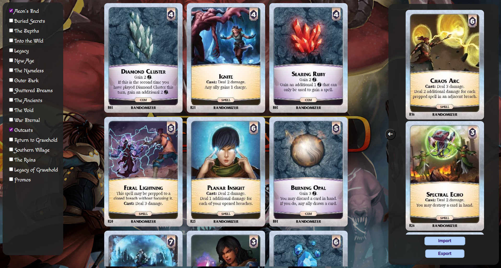

# Aeon's End Market Maker

Ever found it cumbersome to search through all your cards to find a perfect market match for the Nemesis?
Or do you mix your sets with your friends' and you'd like to prepare a nice market set-up in advance?

Aeon's End Market Maker is the tool you need to comfortably create a market set-up of your dreams!

Access the tool under https://github.com/mgraves236/aeons-end-market.
## How to use it?

Aeon's End Market Maker is a tool with straightforward functionalities.

On the left-hand side you can choose which sets you want to use to create your market set-up.

On the right hand side, there is a container in which you can drop the cards of your choosing and then export (save to a
txt file locally) or import your set-up. Click on the arrow next to the container to expand it and view
your cards easier.

The tool will remind you about standard set-up type amount of 3 gems, 2 relics, and 4 spells.
However, it's not required to obey these rules to export/import your configuration.

## Coming functionalities

If you see that the tool is missing something important, feel free to contribute or contact me!

| Functionality                   | State           |
|-------------------------------|-----------------|
| Card filtering based on types | Not implemented |
